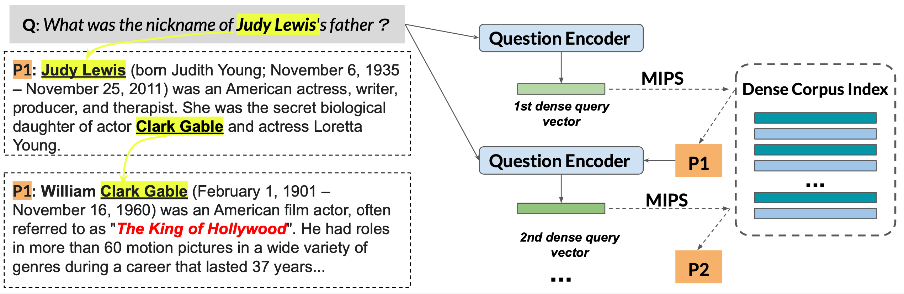

# [<p align=center>Multi-Hop Dense Text Retrieval (`MDR`)</p>](#p-aligncentermulti-hop-dense-text-retrieval-mdrp)

**\*\*\*\*\* Update 3/4/2021: Adding simple demo code based on [streamlit](https://streamlit.io/) \*\*\*\*\***

`MDR` is a simple and generalized dense retrieval method which recursively retrieves supporting text passages for answering complex open-domain questions. The repo provides code and pretrained retrieval models that produce **state-of-the-art** retrieval performance on two multi-hop QA datasets (the [HotpotQA](https://hotpotqa.github.io) dataset and the multi-hop subset of the [FEVER fact extraction and verification dataset](https://fever.ai)). 

More details about our approach are described in our ICLR paper [Answering Complex Open-Domain Questions with Multi-Hop Dense Retrieval](https://arxiv.org/abs/2009.12756)

<p align="center"></p>

- [Use the trained models](#use-the-trained-models)
    - [Evaluating retrieval](#evaluating-retrieval)
    - [Evaluating QA](#evaluating-qa)
    - [Demo](#end-to-end-demo)
- [Train models from scratch](#train-models-from-scratch)
    - [Retriever training](#retriever-training)
    - [Encoding the corpus for retrieval](#encoding-the-corpus-for-retrieval)
    - [ELECTRA QA model training](#electra-qa-model-training)


## Use the trained models

1. Set up the environment
```bash
conda create --name MDR python=3.6
conda activate MDR
git clone git@github.com:facebookresearch/multihop_dense_retrieval.git
cd multihop_dense_retrieval 
bash setup.sh
```

2. Download the necessary data files and pretrained retrieval models
Simplified data files with **quesitons** and ground-truth **supporting passages**:

```
# save pretrained models to models/ and all processed hotpotQA into data/ 
# models will take about 2GB, and data will take 20GB since the pre-trained wikipedia index are included.
bash ./scripts/download_hotpot.sh
```


### Evaluating retrieval
Evalauting direct retrieval performance (The printed statistics might not adhere to the metric names defined in the paper. 
* **PR**: whether one of the supporting passages is included in all retrieved passages; 
* **P-EM**: whether **both** supporting passages are included in all retrieval passages; 
* **Path Recall**: whether any of the topk retrieved chain extract match the ground-truth supporting passages.) and saving topk retrieved passage chains for downstream QA. 

Here's an example evaluating the top1 ranked passage chains:

```
python scripts/eval/eval_mhop_retrieval.py \
    data/hotpot/hotpot_qas_val.json \
    data/hotpot_index/wiki_index.npy \
    data/hotpot_index/wiki_id2doc.json \
    models/q_encoder.pt \
    --batch-size 100 \
    --beam-size 1 \
    --topk 1 \
    --shared-encoder \
    --model-name roberta-base \
    --gpu \
    --save-path ${SAVE_RETRIEVAL_FOR_QA}
```
Sevaral important options includes 
* `--beam-size-n`: beam size at each hop; 
* `--topk`: topk passage chains from beam search 
* `--gpu`: move the dense index to GPU, resulting in much faster search


Expected results (Top1):

```
Evaluating 7405 samples...
	Avg PR: 0.8428089128966915
	Avg P-EM: 0.6592842673869007
	Avg 1-Recall: 0.7906819716407832
	Path Recall: 0.6592842673869007
comparison Questions num: 1487
	Avg PR: 0.9932750504371217
	Avg P-EM: 0.9482178883658372
	Avg 1-Recall: 0.9643577673167452
	Path Recall: 0.9482178883658372
bridge Questions num: 5918
	Avg PR: 0.805001689760054
	Avg P-EM: 0.5866846907739101
	Avg 1-Recall: 0.7470429199053734
	Path Recall: 0.5866846907739101
```

**Note:** For more efficient retrieval on CPU, check out the `--hnsw` option in `scripts/eval/eval_mhop_retrieval.py`. 

### Evaluating QA
The best answer extraction model is based on the pretrained [ELECTRA](https://arxiv.org/abs/2003.10555), outperforming the **BERT-large-whole-word-masking** by ~2 points answer EM/F1. We construct the training data with the pretrained MDR retriever and always include the ground-truth passage chain if the MDR failed. Each training question is paired with the groundtruth SP passage chain and also 5 (hyperparameter) retrieved chains which do not match the groundtruth. 

As the HotpotQA task requires evaluating the prediction of supporting sentences, we do sentence segmetation on the MDR retrieval result before feeding into the answer extraction models. Follow the script [scripts/add_sp_label.sh](scripts/add_sp_label.sh) to annotate the retrieved chains for train/val data. Supposing we got the top100 retrieved results in `data/hotpot/dev_retrieval_top100_sp.json`: 

```
python scripts/train_qa.py \
    --do_predict \
    --predict_batch_size 200 \
    --model_name google/electra-large-discriminator \
    --fp16 \
    --predict_file data/hotpot/dev_retrieval_top100_sp.json \
    --max_seq_len 512 \
    --max_q_len 64 \
    --init_checkpoint models/qa_electra.pt \
    --sp-pred \
    --max_ans_len 30 \
    --save-prediction hotpot_val_top100.json
```

Expected results:

```
01/21/2021 17:01:49 - INFO - __main__ - evaluated 7405 questions...
01/21/2021 17:01:49 - INFO - __main__ - chain ranking em: 0.8113436866981769
01/21/2021 17:01:50 - INFO - __main__ - .......Using combination factor 0.8......
01/21/2021 17:01:50 - INFO - __main__ - answer em: 0.6233625928426739, count: 7405
01/21/2021 17:01:50 - INFO - __main__ - answer f1: 0.7504594111976622, count: 7405
01/21/2021 17:01:50 - INFO - __main__ - sp em: 0.5654287643484133, count: 7405
01/21/2021 17:01:50 - INFO - __main__ - sp f1: 0.7942837708469039, count: 7405
01/21/2021 17:01:50 - INFO - __main__ - joint em: 0.42052667116812964, count: 7405
01/21/2021 17:01:50 - INFO - __main__ - joint f1: 0.6631669237532106, count: 7405
01/21/2021 17:01:50 - INFO - __main__ - Best joint F1 from combination 0.7504594111976622
01/21/2021 17:01:51 - INFO - __main__ - test performance {'em': 0.6233625928426739, 'f1': 0.7504594111976622, 'joint_em': 0.42052667116812964, 'joint_f1': 0.6631669237532106, 'sp_em': 0.5654287643484133, 'sp_f1': 0.7942837708469039}
```

## End to end Demo
A simple demo code using our pretrained models.
```
streamlit run scripts/demo.py
```

<p align="center"></p>


## Train models from scratch
Our experiments are mostly run on 8 GPUs, however, we observed similar performance when using a smaller performance. 

### Retriever training

```
CUDA_VISIBLE_DEVICES=0,1,2,3,4,5,6,7 python scripts/train_mhop.py \
    --do_train \
    --prefix ${RUN_ID} \
    --predict_batch_size 3000 \
    --model_name roberta-base \
    --train_batch_size 150 \
    --learning_rate 2e-5 \
    --fp16 \
    --train_file ${TRAIN_DATA_PATH} \
    --predict_file ${DEV_DATA_PATH}  \
    --seed 16 \
    --eval-period -1 \
    --max_c_len 300 \
    --max_q_len 70 \
    --max_q_sp_len 350 \
    --shared-encoder \
    --warmup-ratio 0.1
```
Processed train/validation data for retrieval training:
* `${TRAIN_DATA_PATH}`: data/hotpot/hotpot_train_with_neg_v0.json
* `${DEV_DATA_PATH}`: data/hotpot/hotpot_dev_with_neg_v0.json

### Finetune the question encoder with frozen memory bank
This step happens after the previous training stage and reuses the checkpoint
point.


```
CUDA_VISIBLE_DEVICES=0,1,2,3,4,5,6,7 python train_momentum.py \
    --do_train \
    --prefix {RUN_ID} \
    --predict_batch_size 3000 \
    --model_name roberta-base \
    --train_batch_size 150 \
    --learning_rate 1e-5 \
    --fp16 \
    --train_file {TRAIN_DATA_PATH} \
    --predict_file {DEV_DATA_PATH}  \
    --seed 16 \
    --eval-period -1 \
    --max_c_len 300 \
    --max_q_len 70 \
    --max_q_sp_len 350 \
    --momentum \
    --k 76800 \
    --m 0.999 \
    --temperature 1 \
    --init-retriever {CHECKPOINT_PT}
```

## Encoding the corpus for retrieval
```
CUDA_VISIBLE_DEVICES=0,1,2,3 python scripts/encode_corpus.py \
    --do_predict \
    --predict_batch_size 1000 \
    --model_name roberta-base \
    --predict_file ${CORPUS_PATH} \
    --init_checkpoint ${MODEL_CHECKPOINT} \
    --embed_save_path ${SAVE_PATH} \
    --fp16 \
    --max_c_len 300 \
    --num_workers 20 
```
* `${CORPUS_PATH}`: each line of this file should be an json encoded object ({"title": str, "text": str}). For HotpotQA, check the authors' [guide](https://hotpotqa.github.io/wiki-readme.html) to get the processed Wikipedia corpus (abstract only).
* `${SAVE_PATH}`: path to save the numpy vectors and ID2DOC lookup table.

### ELECTRA QA model training

The ELECTRA-based QA model is sensitive to the learning rate schedule and adding a 10% warmup stage is necessary to achieve good answer extraction performance in our experiments:
```
CUDA_VISIBLE_DEVICES=0 python train_qa.py \
    --do_train \
    --prefix electra_large_debug_sn \
    --predict_batch_size 1024 \
    --model_name google/electra-large-discriminator \
    --train_batch_size 12 \
    --learning_rate 5e-5 \
    --train_file ${QA_TRAIN_DATA} \
    --predict_file ${QA_DEV_DATA} \
    --seed 42 \
    --eval-period 250 \
    --max_seq_len 512 \
    --max_q_len 64 \
    --gradient_accumulation_steps 8 \
    --neg-num 5 \
    --fp16 \
    --use-adam \
    --warmup-ratio 0.1 \
    --sp-weight 0.05 \
    --sp-pred
```

Processed (ran [scripts/add_sp_label.sh](scripts/add_sp_label.sh)) train/validata data for QA training.
* `${QA_TRAIN_DATA}`: data/hotpot/train_retrieval_b100_k100_sp.json
* `${QA_DEV_DATA}`: data/hotpot/dev_retrieval_b50_k50_sp.json

## Cite
```
@article{xiong2020answering,
  title={Answering Complex Open-Domain Questions with Multi-Hop Dense Retrieval},
  author={Xiong, Wenhan and Li, Xiang Lorraine and Iyer, Srinivasan and Du, Jingfei and Lewis, Patrick and Wang, William Yang and Mehdad, Yashar and Yih, Wen-tau and Riedel, Sebastian and Kiela, Douwe and O{\u{g}}uz, Barlas},
  journal={International Conference on Learning Representations},
  year={2021}
}
```

## License
CC-BY-NC 4.0
